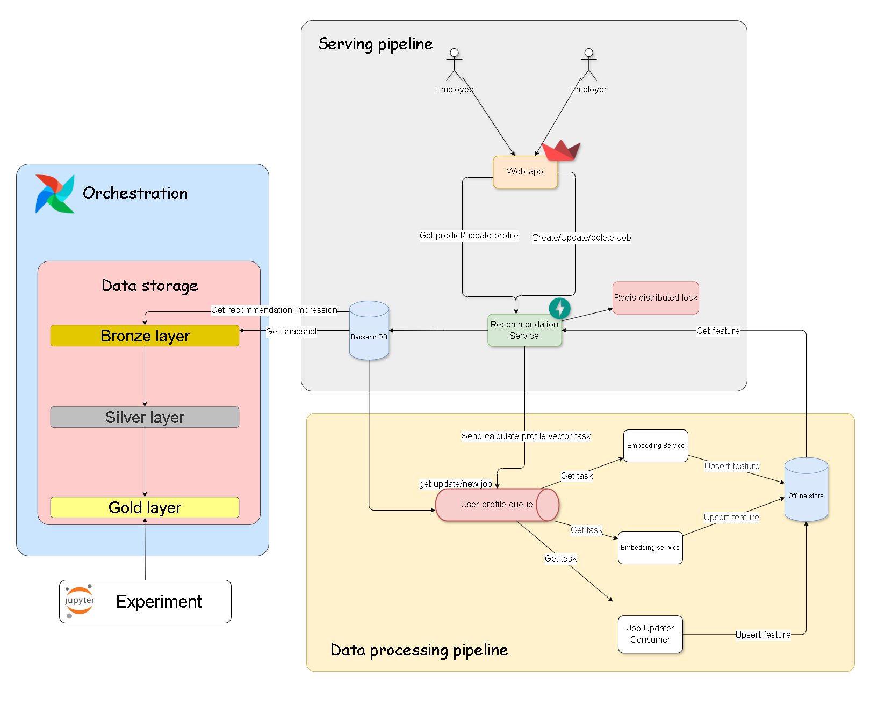

# HUST Graduation Thesis - Job Recommendation Platform

This repository contains a graduation thesis project at Hanoi University of
Science and Technology. The project builds an end-to-end job recommendation
platform: crawl job data, process and enrich it with NLP, store searchable
vectors, and serve personalized job recommendations through a FastAPI backend
and a Streamlit frontend.

## Project Goals

- Build a data platform for collecting and managing IT job postings.
- Extract and normalize skills from job descriptions and user profiles.
- Recommend suitable jobs for candidates using semantic and statistical
  matching signals.
- Provide separate workflows for employees and employers through a web UI.
- Keep expensive NLP/vector computation outside request handling by using Redis
  Queue workers.

## Main Features

- User authentication with JWT for employee and employer accounts.
- Employee profile management: skills, education, experience and location.
- Employer profile management and job posting CRUD.
- Job recommendation using two retrieval branches:
  - TF-IDF + SVD vectors.
  - MiniLM/BERT sentence embeddings.
- Reciprocal Rank Fusion (RRF) to combine TF-IDF and BERT candidates.
- Reranking by skill overlap, location match and salary signal.
- Job skill-gap analysis that separates covered, related and missing skills.
- Background workers for skill embedding, profile/job vector updates and skill
  extraction.
- Airflow DAGs and crawler utilities for ingesting job data.

## Repository Structure

```text
.
├── data/                         # Raw and processed datasets
├── design/                       # Architecture diagrams and DB scripts
│   └── create db.sql             # Core relational schema
├── remote_server_util/           # Remote deployment utilities
├── src/
│   ├── airflow/                  # Airflow Docker image, DAGs and Spark jobs
│   ├── JobUpdateConsumer/        # Redis-based job crawl/update consumer
│   ├── job_matcher_app/
│   │   ├── Backend/              # FastAPI backend
│   │   ├── Frontend/             # Streamlit frontend
│   │   ├── skill_extraction/     # Skill repository and SkillTrie logic
│   │   ├── skill_worker/         # Worker Dockerfiles and TF-IDF worker
│   │   ├── skill_worker.py       # Skill/BERT embedding worker
│   │   ├── skill_extraction_worker.py
│   │   └── outbox.py             # Task outbox helper
│   ├── notebooks/                # EDA, model, vector and DB setup notebooks
│   └── docker-compose.yaml       # Local development stack
└── setup_note.txt                # Short setup notes
```

## Architecture



The system has five main layers:

1. Data ingestion: Airflow DAGs and crawler/consumer code collect job data and
   push updates through Redis.
2. Storage: PostgreSQL with pgvector stores users, companies, jobs, skills,
   extracted skill relations and embedding tables.
3. Model artifacts: MinIO stores TF-IDF/SVD artifacts and NER model checkpoints.
4. Serving: FastAPI exposes authentication, user profiles, jobs and
   recommendations.
5. UI: Streamlit provides the employee and employer application screens.

Background tasks are queued through Redis/RQ. The backend writes task records to
`task_outbox`, enqueues work, and workers update embeddings or extracted skills
asynchronously.

## Tech Stack

- Python 3.10+ for backend/workers, Python 3.13 image for frontend container.
- FastAPI, Uvicorn, SQLAlchemy, asyncpg and psycopg2.
- Streamlit for the frontend.
- PostgreSQL 13 with pgvector.
- Redis and RQ for asynchronous jobs.
- MinIO/S3-compatible storage for model artifacts.
- SentenceTransformers:
  - `alvperez/skill-sim-model` for skill semantic similarity.
  - `paraphrase-multilingual-MiniLM-L12-v2` for profile and job embeddings.
- scikit-learn TF-IDF/SVD artifacts for sparse-text retrieval.
- Transformers token classification model for NER-based skill extraction.
- Airflow, PySpark, BeautifulSoup, requests and MinIO client for data pipeline
  work.

## Prerequisites

- Docker and Docker Compose.
- Python 3.10 or newer for local backend development.
- PostgreSQL with pgvector if running services outside Docker.
- Redis if running workers outside Docker.
- MinIO bucket `models` containing required model artifacts:
  - TF-IDF/SVD artifact under `models/tfidf/`.
  - NER checkpoint under `models/checkpoint-360/` when using
    `SKILL_EXTRACTOR_MODE=ner_skilltrie`.

## Quick Start With Docker

Run commands from the `src` directory because the compose file uses paths
relative to `src`.

```powershell
cd src
docker compose up --build
```

Main local endpoints:

- Frontend: `http://localhost:8501`
- Backend API: `http://localhost:8000`
- Backend health check: `http://localhost:8000/health`
- FastAPI docs: `http://localhost:8000/docs`
- Airflow: `http://localhost:8080` with default `airflow` / `airflow`
- MinIO console: `http://localhost:9001` with default `ROOTUSER` / `1234567890`
- PostgreSQL: `localhost:5432`
- Redis: `localhost:6379`

The compose stack starts PostgreSQL, Redis, MinIO, backend, frontend, Airflow,
workers, a crawl consumer and Triton server. Some workers require model files in
MinIO before they can start successfully.

## Database Setup

The compose file starts the PostgreSQL container, but application tables and
vector tables still need to be prepared before using recommendation flows.

1. Create the application database if it does not exist:

   ```sql
   CREATE DATABASE job_db_2;
   ```

2. Enable pgvector in the application database:

   ```sql
   CREATE EXTENSION IF NOT EXISTS vector;
   ```

3. Run the core schema in `design/create db.sql`.

4. Run the setup/vector notebooks when needed:

   - `src/notebooks/setup_db.ipynb` for skills and skill embeddings.
   - `src/notebooks/make_tfidf_vector.ipynb` for `job_embeddings_tfidf`.
   - `src/notebooks/make_bert_vector.ipynb` or related RRF notebooks for
     `job_embeddings_bert`.

The runtime code also expects tables such as `skill_embeddings`,
`user_profile_embedding`, `employee_education_embedding`,
`employee_experience_embedding`, `job_embeddings_tfidf` and
`job_embeddings_bert`.

## Running Services Locally

Backend:

```powershell
cd src\job_matcher_app\Backend
python -m venv .venv
.\.venv\Scripts\Activate.ps1
pip install -r requirements.txt
$env:PYTHONPATH="..\..;."
uvicorn main:app --reload --host 0.0.0.0 --port 8000
```

Frontend:

```powershell
cd src\job_matcher_app\Frontend
python -m venv .venv
.\.venv\Scripts\Activate.ps1
pip install -r requirements.txt
$env:API_BASE_URL="http://localhost:8000"
streamlit run streamlit_app.py
```

Skill/BERT worker:

```powershell
cd src
$env:PYTHONPATH="."
python job_matcher_app\skill_worker.py
```

TF-IDF worker:

```powershell
cd src
$env:PYTHONPATH="."
python job_matcher_app\skill_worker\skill_worker_tfidf.py
```

Skill extraction worker:

```powershell
cd src
$env:PYTHONPATH="."
$env:SKILL_EXTRACTOR_MODE="ner_skilltrie"
python job_matcher_app\skill_extraction_worker.py
```

## Important Environment Variables

Backend and workers:

```text
PG_HOST=localhost
PG_PORT=5432
PG_DATABASE=job_db_2
PG_USER=airflow
PG_PASSWORD=airflow
REDIS_HOST=localhost
REDIS_PORT=6379
REDIS_DB=0
MINIO_ENDPOINT=localhost:9000
MINIO_ACCESS_KEY=ROOTUSER
MINIO_SECRET_KEY=1234567890
MINIO_BUCKET=models
MINIO_SECURE=false
SECRET_KEY=<change-in-production>
ACCESS_TOKEN_EXPIRE_MINUTES=1440
```

Queue/model variables:

```text
TFIDF_QUEUE_NAME=profile-tfidf-queue
SKILL_EXTRACTION_QUEUE_NAME=job-skill-extraction-queue
TFIDF_MODEL_PREFIX=models/tfidf/
SKILL_EXTRACTOR_MODE=ner_skilltrie
NER_MODEL_PREFIX=models/checkpoint-360/
SKILL_REPO_SCHEMA=public
```

Frontend:

```text
API_BASE_URL=http://localhost:8000
```

## API Overview

Mounted FastAPI route groups:

- `POST /auth/login` and `POST /auth/employer/login`.
- `POST /users/employees` and `POST /users/employers`.
- `GET /users/me`, employee profile and employer profile endpoints.
- `POST`, `PATCH`, `DELETE` endpoints for employee education, experience and
  skills.
- `POST /jobs`, `PATCH /jobs/{job_id}`, `GET /jobs/{job_id}` and employer job
  listing.
- `GET /recommendations/me/jobs` for fused and reranked recommendations.
- `GET /recommendations/me/jobs/tfidf` and `/bert` for individual retrieval
  branches.
- `GET /jobs/{job_id}/skill-gap` for skill-gap analysis.

Open `http://localhost:8000/docs` after starting the backend for request and
response schemas.

## Data And Model Workflow

1. Crawl or import job postings into PostgreSQL.
2. Build the skill taxonomy and populate `skills` / `skill_embeddings`.
3. Generate TF-IDF/SVD and BERT job vectors.
4. Upload model artifacts to MinIO.
5. Start backend and workers.
6. Create/update user profiles and job postings through API/UI.
7. Workers update profile/job vectors and extracted job skills.
8. Recommendation endpoints retrieve candidates, fuse rankings, rerank and
   return job details.

## Notes And Limitations

- Default credentials and secrets in Docker config are for local development
  only.
- Recommendation quality depends on prepared vector tables and available MinIO
  artifacts.
- Some setup steps currently live in notebooks, so DB initialization is not yet a
  single automated migration command.
- The Docker stack includes optional or experimental services such as Triton and
  Airflow components that may not be required for frontend/backend-only work.

## Acknowledgements

This project uses open-source tools from the Python, FastAPI, Streamlit,
Airflow, PostgreSQL, Redis, MinIO, Hugging Face and scikit-learn ecosystems.
